---

# 💼 UR-SARTHI — Full Stack Mentorship Platform

**UR-SARTHI** is a scalable and modern full-stack mentorship platform that connects mentees (students or professionals) with experienced mentors across various domains. The platform is designed to make mentorship accessible, structured, and convenient for all users. Mentees can sign up using OTP-based authentication, build their profiles with personal and educational details, explore mentor profiles based on expertise and availability, and book appointments for personalized one-on-one sessions. Additional features like free resources, job listings, appointment management, and secure payments using Razorpay are also integrated to enhance the user experience.

On the **mentor side**, professionals can register and create detailed public profiles showcasing their skills, languages, achievements, and availability schedule. Mentors can manage incoming appointment requests, accept or reject them, and even conduct sessions through a built-in video calling feature. The mentor dashboard provides clear visibility into upcoming sessions and previous interactions, making it easier to track and engage with mentees effectively.

Technically, the frontend is divided into two separate React.js applications—one for mentees and one for mentors—each styled using Tailwind CSS and managed using React Context API. The backend is built with **Node.js**, **Express.js**, and **MongoDB**, offering robust functionality for OTP authentication, user roles, appointment scheduling, payment handling, and image uploads via Cloudinary. Axios handles API communication across the apps, and role-based access is secured with JWT and middleware.

This project is ideal for educational communities, institutions, or startups looking to implement a mentorship-based solution. The architecture supports modular scaling and can easily integrate additional features like chat, email notifications, or analytics. Contributions and feedback are welcome!

---

## 📦 Repositories

- 🔗 **User (Mentee) Frontend:** [GitHub Link](https://github.com/kumarrohit2002/UR_Sarthi-User)
- 🔗 **Mentor Frontend:** [GitHub Link](https://github.com/kumarrohit2002/UR_Sarthi-Mentor)
- 🔗 **Backend (API Server):** [GitHub Link](https://github.com/kumarrohit2002/UR_Shathi_BE)

---


---

## 🧑‍🏫 PART 1: USER (MENTEE) MODULE [🌐 Website Link](https://ur-sarthi-user.vercel.app/)

---


---

### 🧪 Sample User Workflow

1. **🔐 Signup/Login**
   - Visit the [website](https://ur-sarthi-user.vercel.app/)
   - Sign up or log in using your email and OTP authentication.
   - Once verified, you are redirected to the homepage.

2. **👤 Complete Your Profile**
   - Navigate to your profile section.
   - Fill in your personal details:
     - **Name**
     - **Email**
     - **Address**
     - **Phone Number**
     - **About/Bio**
   - Save your updated profile.

3. **🔍 Explore and Search for Mentors**
   - Go to the **Search Page** or **Category Page**.
   - Use filters or search keywords to find a suitable mentor.
   - View detailed mentor profiles including:
     - Area of expertise
     - Years of experience
     - Ratings & Reviews
     - Availability

4. **📅 Book an Appointment**
   - Choose a mentor and click on **Book Appointment**.
   - Select a preferred date and time based on the mentor’s availability.
   - Confirm the booking and proceed to the payment page.

5. **💳 Complete the Payment**
   - Securely pay using Razorpay payment gateway.
   - On successful payment, you will be redirected to the **Success Page**.
   - In case of any issue, you'll be directed to the **Failed Page**.

6. **📥 Receive Confirmation & Notification**
   - After booking, receive a confirmation notification.
   - Booking details are stored in the **My Bookings** section.

7. **📆 Manage Upcoming Appointments**
   - Visit **My Bookings** to view your scheduled sessions.
   - Join video sessions via the **Room** page at the scheduled time.
   - You can also cancel or reschedule appointments if needed.

8. **📘 Access Free Learning Resources**
   - Navigate to the **Free Resource** section.
   - Download or explore curated resources for skill enhancement.

9. **🔔 Stay Notified**
   - Get real-time alerts for booking confirmations, reminders, and mentor updates via the **Notification** component.

10. **🔚 Logout or Explore More**
    - You can log out at any time or continue exploring other mentors and services.

---


### 📁 Folder Structure (Relevant for Mentors)

```
src/
├── pages/
│   ├── AboutSection.jsx
│   ├── BookAppointmentPage.jsx
│   ├── CategoryPage.jsx
│   ├── MyBooking.jsx
│   ├── HomePage.jsx
│   ├── MentorAboutPage.jsx
│   ├── JobApply.jsx
│   ├── JobPortal.jsx
│   ├── Profile.jsx
│   ├── SearchPage.jsx
│   ├── Success.jsx         # Payment Success Page
│   ├── Failed.jsx          # Payment Failed Page
│   └── Room.jsx            # Video Call Page
│
├── components/
│   ├── Benefits.jsx
│   ├── Button.jsx
│   ├── CategoryCard.jsx
│   ├── Collaboration.jsx
│   ├── CompanyLogos.jsx
│   ├── EditUserProfile.jsx
│   ├── Footer.jsx
│   ├── FreeResourceCard.jsx
│   ├── Generating.jsx
│   ├── Header.jsx
│   ├── Heading.jsx
│   ├── Hero.jsx
│   ├── Loader.jsx
│   ├── MentorCard.jsx
│   ├── MyBookingCard.jsx
│   ├── Navbar.jsx
│   ├── Notification.jsx
│   ├── OtpInput.jsx
│   ├── Pricing.jsx
│   ├── PricingList.jsx
│   ├── Roadmap.jsx
│   ├── Section.jsx
│   ├── Services.jsx
│   └── SignUp.jsx
│
├── Context/
│   ├── MentorContext.jsx
│   ├── AuthZContext.jsx
│   └── UserProfileContext.jsx
```

---

### ✨ Features for Users (Mentees)

- **🏠 Main Page (HomePage)**  
  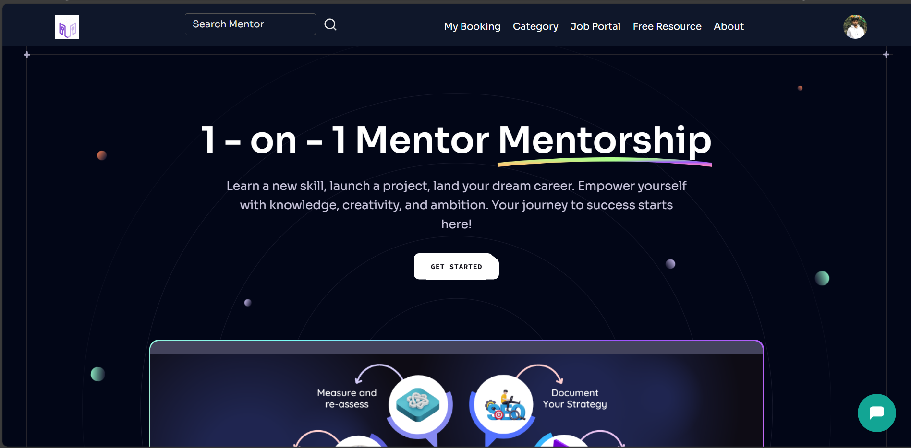

- **🔐 User Signup/Login**  
  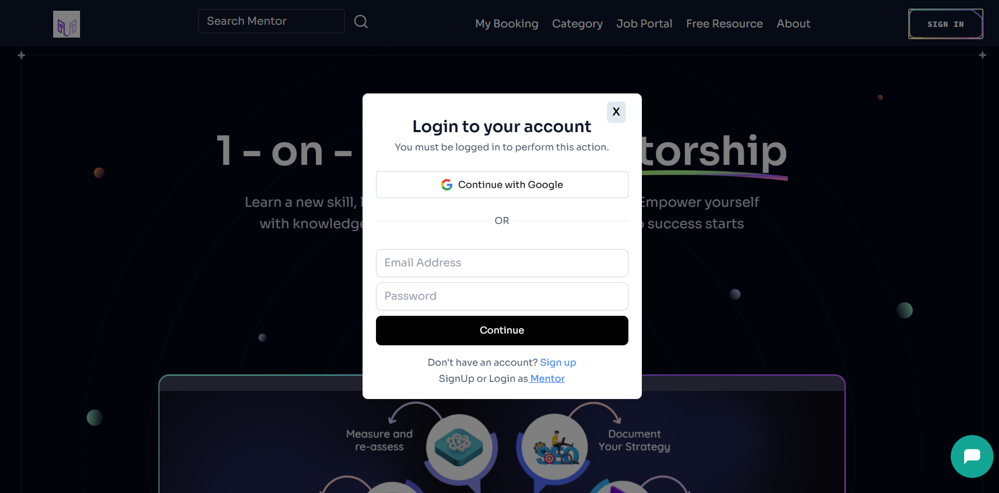

- **🔐 User Signup/Login**  
  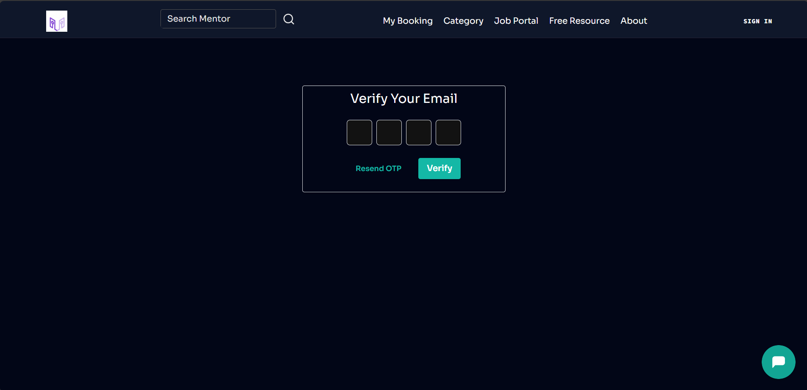

- **👤 Create & Update Detailed User Profile**  
  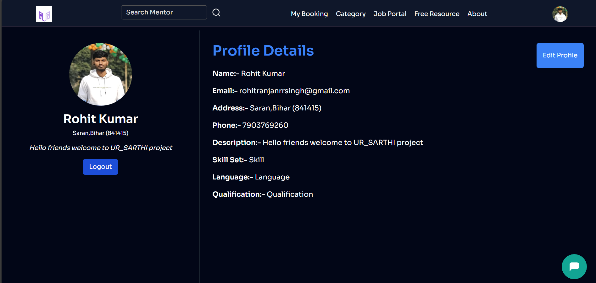

- **📅 View and Manage Booked Appointments**  
  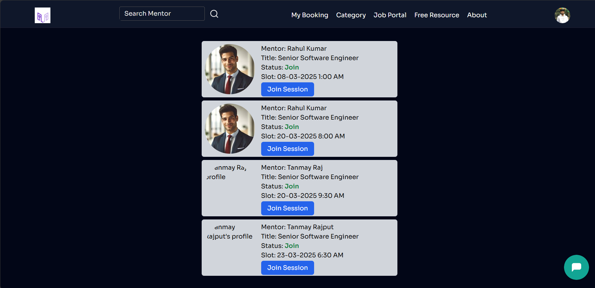

- **📘 Access Free Resources**  
  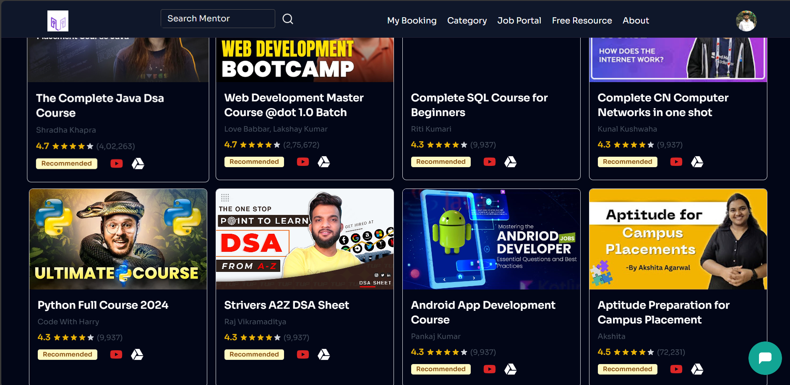

- **🔍 Mentor Search Page**  
  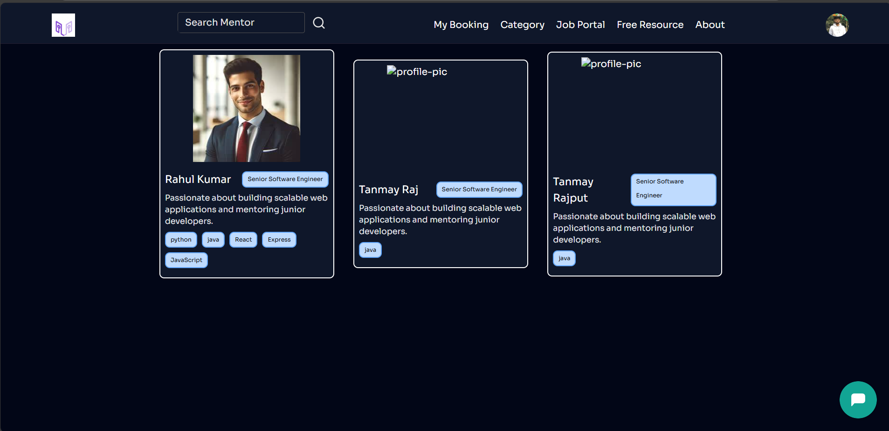

- **👨‍🏫 Mentor Profile Page**  
  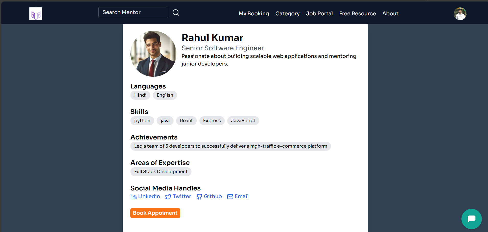

- **📆 Appointment Booking Page**  
  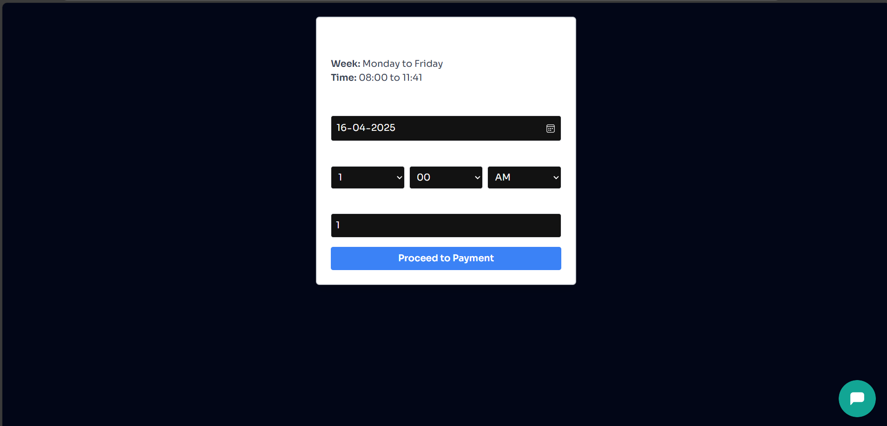

- **💳 Payment Handling Page**  
  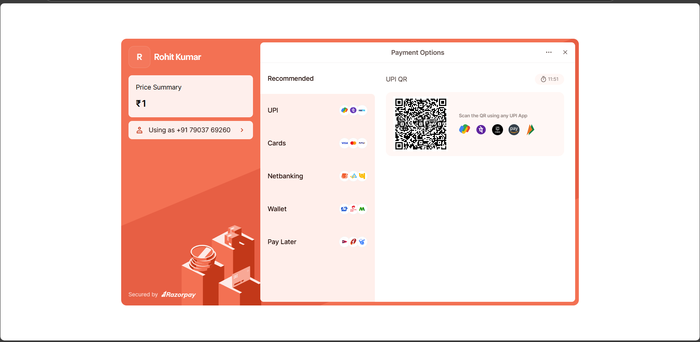

- **ℹ️ Website About Page**  
  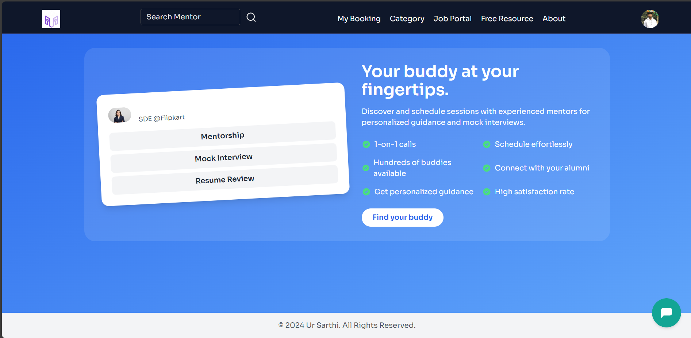

---


---

## 🔧 Tech Stack

- **Frontend**: React.js  
- **Styling**: Tailwind CSS  
- **Routing**: React Router  
- **API Calls**: Axios  
- **State Management**: React Context API  
- **Payments**: Razorpay Integration  
- **Notifications**: React Toastify  

---

## 🚀 Getting Started

1. **Clone the Repository**
   ```bash
   git clone https://github.com/your-username/ursarathi-frontend.git
   cd ursarathi-frontend
   ```

2. **Install Dependencies**
   ```bash
   npm install
   ```

3. **Create `.env` File**
   ```env
   REACT_APP_API_BASE_URL=http://localhost:4000/api/v1
   REACT_APP_RAZORPAY_KEY=your_razorpay_key
   ```

4. **Run the App**
   ```bash
   npm start
   ```

5. Visit: `http://localhost:3000`

---

## 🤝 Contributing

We welcome contributions for UI improvements, bug fixes, or new features.  
Fork the repo, make your changes, and submit a pull request.

---

## 📜 License

This project is licensed under the [MIT License](LICENSE)

---

## 🙌 Special Thanks

Big thanks to all mentors and mentees for being a part of the UR-SARTHI community and making knowledge sharing accessible to all!

---
